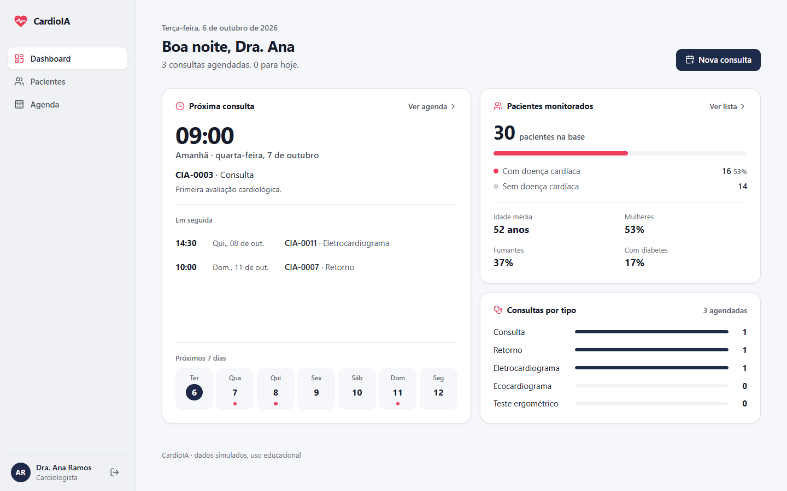
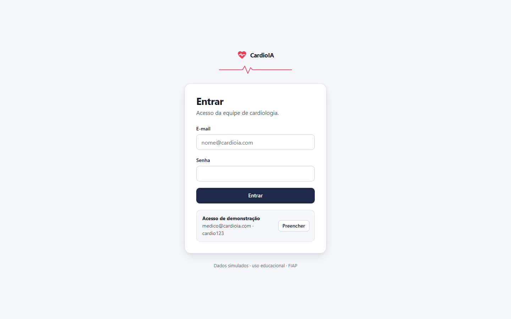
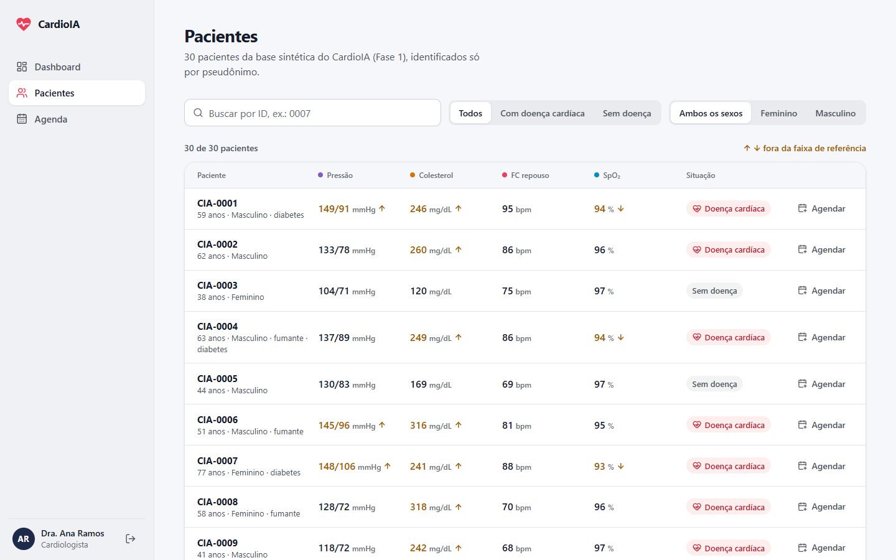
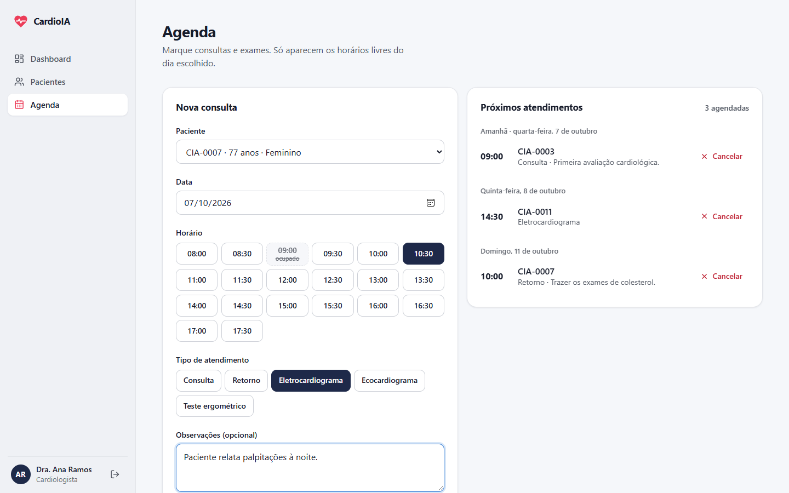
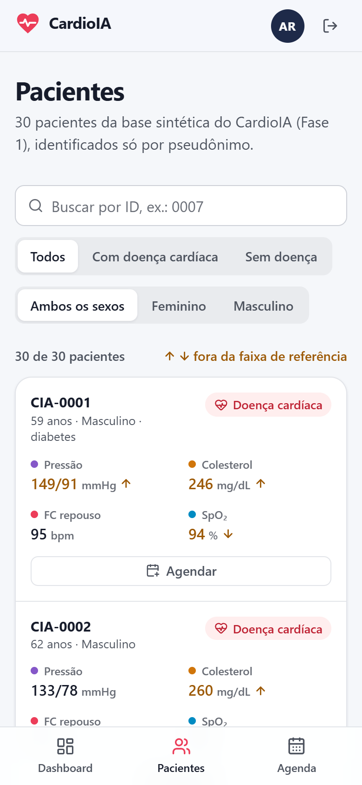

# CardioIA · Portal

> Projeto acadêmico FIAP — Curso de Inteligência Artificial
> **Fase 2 · Ir Além 1:** interface do CardioIA em React + Vite, com login simulado,
> pacientes, agendamento de consultas e dashboard. Sem back-end: os dados são simulados.

**Vídeo de demonstração (YouTube, não listado):** _adicionar o link aqui_

**Projeto principal da Fase 2:** [CardioIA-Fase2](https://github.com/souzaleite-dev/CardioIA-Fase2)



---

## 1. Funcionalidades

| Requisito da atividade | Como foi feito | Onde está |
|---|---|---|
| Autenticação simulada via Context API, com JWT fake no localStorage | Login com latência simulada; token `header.payload.assinatura` com expiração de 1 hora e saída automática quando expira | `src/contexts/AuthContext.jsx`, `src/services/auth.js` |
| Listagem de pacientes por API fake ou base simulada | 30 pacientes da base sintética da Fase 1, buscados por `fetch` com esqueleto de carregamento, erro e vazio; busca por ID, filtros segmentados por situação e sexo, valores fora da referência marcados com seta | `src/pages/Pacientes/`, `src/services/pacientesApi.js`, `public/api/pacientes.json` |
| Formulário de agendamento com `useState` e `useReducer` | `useReducer` controla campos e erros; `useState`, a confirmação. Horários em chips que mostram o que está ocupado ou encerrado no dia escolhido; valida data passada, horário encerrado, fora do expediente e conflito de agenda | `src/pages/Agendamento/` |
| Dashboard com contagem de pacientes e consultas | Próxima consulta, faixa dos próximos 7 dias, pacientes monitorados com a proporção de doença cardíaca, perfil da base e consultas agendadas por tipo | `src/pages/Dashboard/` |
| Proteção de rotas com AuthContext | Sem sessão, qualquer rota interna leva ao login, que devolve o usuário à página que ele tentou abrir | `src/components/RotaPrivada.jsx`, `src/App.jsx` |
| Estilização com CSS Modules | Um `*.module.css` por componente e página; cores em OKLCH, raios e sombras como variáveis em `src/index.css`. Visual inspirado no app Saúde da Apple, documentado em [`docs/DESIGN.md`](docs/DESIGN.md) | `src/**/*.module.css` |

---

## 2. Como executar

Requisitos: Node.js 20.19+ ou 22.12+.

```bash
npm install
npm run dev        # abre em http://localhost:5173
npm test           # 15 testes automáticos (JWT fake, agenda, validação do formulário e nomes)
npm run lint       # ESLint, incluindo as regras oficiais de Hooks do React
npm run build      # build de produção em dist/
npm run preview    # serve o build em http://localhost:4173
```

**Acesso de demonstração:** e-mail `medico@cardioia.com` · senha `cardio123`. A tela de
login tem um botão que preenche os dois campos.

---

## 3. Telas

| Login | Pacientes |
|---|---|
|  |  |

| Agendamento | Celular |
|---|---|
|  |  |

### Rotas

| Rota | Acesso | Página |
|---|---|---|
| `/login` | pública | Login; com sessão ativa, redireciona para o portal |
| `/` | protegida | Dashboard |
| `/pacientes` | protegida | Lista de pacientes |
| `/agendamento` | protegida | Agendamento; aceita `?paciente=CIA-0007` para chegar com o paciente escolhido |
| qualquer outra | pública | Página não encontrada |

---

## 4. Estrutura de pastas

```
souzaleite-cardioia-portal/
├── public/
│   ├── api/pacientes.json        # base simulada (30 pacientes da Fase 1)
│   └── favicon.svg
├── src/
│   ├── contexts/                 # estado global
│   │   ├── AuthContext.jsx       # sessão: entrar, sair, expiração do token, useAuth()
│   │   ├── ConsultasContext.jsx  # agenda persistida no localStorage, useConsultas()
│   │   └── consultasReducer.js   # reducer puro da agenda (agendar, cancelar)
│   ├── services/                 # acesso a dados
│   │   ├── auth.js               # login simulado e JWT fake (criar, ler, expirar)
│   │   └── pacientesApi.js       # fetch da base simulada, com latência e cache
│   ├── components/               # peças reutilizáveis, cada uma com seu .module.css
│   │   ├── Layout/               # barra lateral (abas no celular), usuário logado e conteúdo
│   │   ├── RotaPrivada.jsx       # proteção de rotas
│   │   ├── Botao/ Campo/ Segmentado/ Marca/ CabecalhoPagina/
│   │   ├── LinhaPaciente/        # linha da lista + limiares de referência dos sinais
│   │   └── Estado/               # esqueleto de carregamento, erro e vazio
│   ├── pages/
│   │   ├── Login/ Dashboard/ Pacientes/ NaoEncontrada/
│   │   └── Agendamento/          # página + formulario.js (reducer e validação)
│   ├── hooks/usePacientes.js     # busca com carregamento, erro e "tentar novamente"
│   ├── utils/                    # datas em pt-BR e nomes (saudação, nome curto, iniciais)
│   ├── App.jsx                   # rotas
│   ├── main.jsx                  # providers: Router > Auth > Consultas
│   └── index.css                 # variáveis de design e estilos base
├── docs/                         # PRODUCT.md, DESIGN.md e telas do README
└── tests/                        # node --test, sem dependências extras
```

---

## 5. Decisões técnicas

- **Context API com hook próprio.** `useAuth()` e `useConsultas()` encapsulam o
  `useContext` e falham com mensagem clara se usados fora do provider. Os valores do
  contexto são memorizados (`useMemo`/`useCallback`) para não renderizar a árvore à toa.
- **`useReducer` em dois níveis.** A agenda (global) e o formulário (local) têm reducers
  puros, testados sem navegador. A validação também é uma função pura, que recebe a data e
  a hora atuais por parâmetro.
- **JWT fake.** O token tem o formato de um JWT de verdade (`alg: none`, payload com `sub`,
  `nome`, `papel`, `iat`, `exp`, acentos preservados em UTF-8) e fica no localStorage. É uma
  **simulação**: sem assinatura verificável, qualquer pessoa poderia forjar um token no
  navegador. Num sistema real, o servidor emitiria e validaria o token, de preferência em
  cookie `HttpOnly`.
- **API simulada.** `fetch` de um JSON estático com 600 ms de latência artificial, para os
  estados de carregamento e erro aparecerem como numa API real. A promessa fica em cache
  e as três páginas compartilham uma única busca.
- **Hooks usados:** `useState`, `useEffect` (busca com cancelamento, persistência da agenda,
  temporizador de expiração), `useContext`, `useReducer`, `useMemo`, `useCallback`, `useId`
  e o hook próprio `usePacientes`.
- **Design.** Referência: app Saúde da Apple. Fundo claro, painéis brancos com linhas finas,
  azul-marinho da marca nas ações e o vermelho do coração só onde significa algo; cada tipo de
  sinal vital tem um marcador de cor próprio. Barra lateral no desktop e abas embaixo no celular.
  Intenção em [`docs/PRODUCT.md`](docs/PRODUCT.md) e sistema visual em [`docs/DESIGN.md`](docs/DESIGN.md).
- **Ícones:** [Lucide](https://lucide.dev) (`lucide-react`), um único estilo de traço em todo o portal.
- **Acessibilidade e responsividade.** Rótulos ligados aos campos por `useId`, erros
  anunciados (`aria-invalid`, `aria-describedby`), confirmação e contagem em `aria-live`,
  link "Pular para o conteúdo", foco visível e `prefers-reduced-motion`. O layout vai de
  360 px a desktop sem rolagem horizontal (conferido em 360, 375 e 1280 px).

---

## 6. Dados

`public/api/pacientes.json` traz os 30 primeiros registros da base sintética da
[Fase 1](https://github.com/souzaleite-dev/CardioIA-Fase1) (`data/cardioia_pacientes.csv`).
Não há dado pessoal: os pacientes aparecem só pelo pseudônimo (`CIA-0001`…), o mesmo
princípio de privacidade da Fase 1. A agenda fica no localStorage do navegador (chave
`cardioia:consultas`) e começa com três consultas de exemplo nos próximos dias.
Material de uso educacional.

---

**Integrante:** Bruno de Souza Leite — RM 567213
**FIAP — Inteligência Artificial** · Fase 2 · Ir Além 1 · 2026
